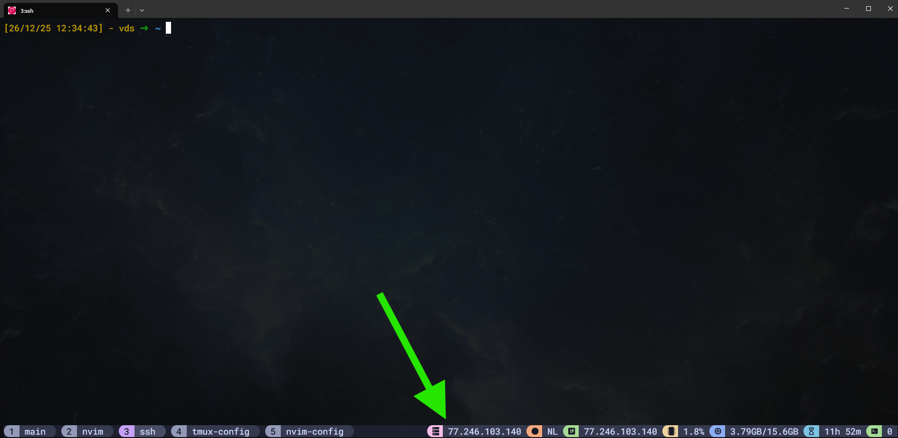

# tmux-ssh-hostname

Display SSH hostname in tmux status bar.



## Installation

Add to your `tmux.conf`:

```bash
set -g @plugin 'egracens/tmux-ssh-hostname'
```

Press `prefix + I` to install.

## Usage

Add `#{ssh_hostname}` to your status bar:

```bash
set -g status-right "#{ssh_hostname}"
```

The plugin exports `@ssh_hostname` variable. You can also reference it as `#{E:@ssh_hostname}` in other tmux options.

## Catppuccin Theme

Create a module file:

```bash
# ~/.config/tmux/modules/ssh_host.conf
%hidden MODULE_NAME="ssh_host"

set -gq "@catppuccin_${MODULE_NAME}_icon" "󰒋 "
set -gqF "@catppuccin_${MODULE_NAME}_color" "#{E:@thm_pink}"
set -gq "@catppuccin_${MODULE_NAME}_text" " #{E:@ssh_hostname}"

source -F "$HOME/.config/tmux/plugins/tmux/utils/status_module.conf"
```

Source the module in your `tmux.conf`:

```bash
source -F "$HOME/.config/tmux/modules/ssh_host.conf"
```

Add to status bar (conditional hides when not in SSH):

```bash
set -g status-right "#{?#{m:ssh,#{pane_current_command}},#{E:@catppuccin_status_ssh_host},}"
```

The `#{?condition,true,false}` syntax shows the module only when pane is running SSH.

## License

MIT
